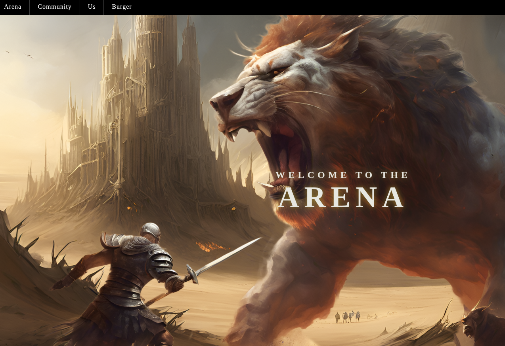

# 🏟 Arena Website HTML
> Modern approaches to layout and animation in frontend.

> Arena is a one—page website with interactive navigation, parallax animation, and a modal slideshow of images.
The project demonstrates modern approaches to layout and animation using SAP and ScrollTrigger.

## [Click to see the website](https://antilopinae.github.io/WebsiteParallaxHTML/)

 🌐 Multi-level navigation menu

 🪄 Parallax

 📸 Image gallery with modal window and navigation

 📱 Adaptive design

## Screenshots

 
## License
This project is distributed under a license [MIT](LICENSE).
